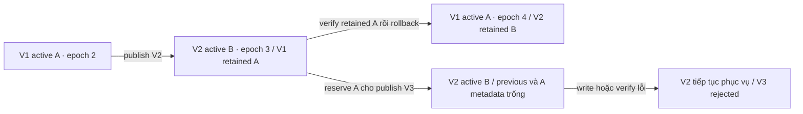

# Checkpoint C — Failure injection, rollback and acceptance evidence

## Phạm vi và môi trường

- Ngày chạy: 2026-10-05; Windows, Python 3.11, virtualenv hiện có của `SAG/apps/api`.
- Branch: `feat/Thang-checkpoint-c-failure-rollback-be-api`, base `0102e1e` (PR #19).
- PostgreSQL model/transaction được kiểm tra bằng SQLite; Qdrant dùng `httpx.MockTransport` có state payload dùng chung giữa các lần publish/rollback/query.
- Đây là evidence ở cấp service/contract. Chưa nghiệm thu PostgreSQL advisory/row locks đa process, Qdrant thật, process crash hoặc tải production.
- Theo xác nhận của Thang, DATN-35 / `ROUTING_READY` đã hoàn thành. Checkpoint B được giữ hoàn tất trong todo; task này không chạy lại acceptance B.

## Kết quả cuối

| Kiểm tra | Kết quả |
|---|---|
| 5 module liên quan Checkpoint C, retrieval và routing (sau review fix) | **64 passed in 7.78s** |
| Riêng `test_checkpoint_c_failure_rollback.py` | **12 passed in 3.09s** |
| Ruff trên 2 file Python review-fix | **All checks passed** |
| Compile 2 file Python review-fix | **Pass** |
| Build API wheel và sdist bằng `uv build` (implementation trước review-fix) | **Pass**; review-fix không đổi package metadata/dependency; build chưa chạy lại |
| `uv run` isolated test environment sau review-fix | **Blocked**; `litellm` build cần MSVC `link.exe` không có trên host; dùng `.venv` hiện có để chạy tests |
| `git diff --check` | **Pass** |
| Full API suite `pytest -q --tb=no` | Đã dừng sau khoảng 6 phút không hoàn tất; không có tổng kết, không tính là pass |
| Chạy chẩn đoán full suite với `-x --tb=short` | **1 failed, 34 passed, 4 warnings in 12.15s** |
| Ruff toàn API | **163 findings** ngoài các file đã thay đổi; chưa phải lint toàn repo sạch |

Lỗi đầu tiên của full suite: `tests/test_acl_runtime.py::test_global_scope_is_applied_before_search_unit_candidate_generation`. Mock `record_search_unit_scope` không nhận keyword `query_strategy_plan`, trong khi `sag_api/api/v1/search.py::_prepare_global_search` truyền keyword này. Hai file không khác task base; lỗi này không được sửa trong scope Checkpoint C. Không suy ra trạng thái của các test chưa chạy từ lần dừng sớm này.

## Ma trận chứng cứ

Các đường dẫn test dưới đây nằm trong `SAG/apps/api/tests/`.

| Scenario | Test / bằng chứng |
|---|---|
| Publish thành công | `test_rollback_restores_matching_postgres_manifest_and_qdrant_slot`: publish V1/SLOT_A rồi V2/SLOT_B, kiểm tra version/status/epoch khi restore V1. Các publish thực thi clear/write/verify/switch thật qua mock HTTP. |
| Subtree build lỗi | `test_checkpoint_c_incremental.py::test_subtree_build_failure_keeps_previous_tree_serving`: lỗi tại `rebuild_drifted_subtree`; không có Qdrant request; pointer/status/epoch và routing snapshot trước/sau giữ nguyên. Đây là legacy coordinator build boundary, chưa phải DATN-58→publisher integration. |
| Quality gate lỗi | `test_quality_gate_failure_keeps_previous_query_snapshot`: candidate bị từ chối trước staging; query cũ và mới vẫn đọc được active tree qua dense/sparse Qdrant filters. |
| Manifest/checksum/count lỗi | `test_verification_failure_keeps_previous_tree[manifest/checksum/count]`: candidate đã stage bị `REJECTED`; active V1/SLOT_A/epoch2 không đổi; dense/sparse đọc V1 thành công. |
| ACK chưa completed | `test_checkpoint_c_publish.py::test_acknowledged_only_payload_write_cannot_switch_active_pointer`: response chỉ acknowledged không cho switch. |
| ACL payload sai | `test_checkpoint_c_publish.py::test_acl_smoke_rejects_wrong_point_source_with_correct_counts`: count đúng nhưng source sai vẫn bị từ chối. |
| Partial Qdrant write | `test_partial_qdrant_batch_write_keeps_active_slot_queryable`: đã ghi batch đầu lên A, batch thứ hai trả 500; V2/B/epoch3 và payload B giữ nguyên, query đọc V2; candidate bị reject, A/previous metadata bị thu hồi. |
| Pointer switch lỗi | `test_atomic_switch_failure_rolls_back_and_rejects_candidate`: SQLAlchemy `before_commit` ném lỗi sau khi pointer đã dirty; transaction rollback giữ V1/A/epoch2, manifest cũ ACTIVE, candidate REJECTED; dense/sparse query vẫn đọc V1. |
| Rollback trong retained-slot window và retry idempotent | `test_rollback_restores_matching_postgres_manifest_and_qdrant_slot`: V1/A được verify rồi restore, epoch tăng từ 3→4; gọi lại với cùng `target_tree_version` trả cùng kết quả và không đổi pointer/slot/epoch; PG pointer/manifest/checksum/slot và Qdrant A cùng V1; query mới đọc V1. |
| Rollback target không hợp lệ | `test_rollback_rejects_target_that_is_not_the_retained_version`: target không phải retained version bị từ chối và active tree/slot/previous pointer/epoch không đổi. |
| Rollback bị từ chối | `test_rollback_verification_failure_keeps_current_tree_active[qdrant/checksum/profile]`: retained slot, checksum hoặc scoped profile bị sửa; rollback không đổi pointer/status/epoch, query vẫn đọc V2/B. |
| Đọc chồng lấp publish/rollback | `test_concurrent_requests_keep_one_snapshot_across_publish_and_rollback`: giữ snapshot V1/A/2 và bắt đầu Qdrant dense/sparse reads đang chờ; publish V2/B/3; giữ snapshot V2 và bắt đầu lượt đọc thứ hai đang chờ; rollback V1/A/4; rồi giải phóng cả hai lượt đang chạy và một lượt mới. Cả ba trả đúng version theo route/ACL đã pin. Lease B còn sống chặn publish kế tiếp sau rollback. |
| Chống reuse slot | `test_checkpoint_c_publish.py::test_live_request_lease_prevents_reusing_its_inactive_slot`: query giữ A, publish B thành công, publish tiếp vào A bị chặn cho tới khi release lease. |

Test không chỉ so sánh object snapshot: `_assert_pinned_read` gọi `route_snapshot` → retrieval `_query_group` → `SearchUnitQdrantStore`; mock giữ Qdrant reads đang chạy trong khi publish/rollback đổi pointer, sau đó áp dụng các `must`/`should` filter thật và kiểm tra kết quả theo tree version/source/document version/partition. Các test retrieval riêng bao phủ capture/release của request, local/escape reads và canonical evidence hydration. Đây là controlled service-level overlap, không giả nhận là HTTP end-to-end hoặc distributed production load.

## Quy tắc rollback và trạng thái

`tree_rollback_service.rollback_tree_candidate(project_id, target_tree_version=..., qdrant_client=...)` dùng cùng project writer lock với publisher. Hàm chỉ chuyển sang target nếu nó là version retained; nếu target đã active (retry sau kết quả commit không rõ), hàm kiểm tra active manifest/status, scoped profiles, SearchUnit mappings và Qdrant slot rồi trả kết quả hiện tại mà không đổi pointer hoặc tăng epoch. Cả hai nhánh đóng transaction trước Qdrant I/O và verify count/point identity/ACL/slot.



Retention window hiện là khoảng thời gian slot đối diện vẫn giữ nguyên version trước. Publish kế tiếp kết thúc window ngay khi reserve slot trong PostgreSQL, trước remote write. Không có cấu hình retention theo phút/giờ ở task base. Rollback không viết Qdrant, không dựng lại slot đã bị reuse; nếu slot hỏng hoặc đã mất thì từ chối, giữ active hiện tại.

## Code review và sửa finding

Đã rà theo `code-review-and-quality`: correctness, readability, architecture, security, performance.

1. **P1 — rollback metadata có thể quảng bá slot đã bị ghi một phần.** Sửa bằng thu hồi `previous_tree_version` và version của inactive slot trong staging transaction; active pointer vẫn giữ nguyên. Có regression partial batch và rollback ngoài window.
2. **P2 — lỗi atomic switch để candidate ở trạng thái chưa bị từ chối.** Đưa switch exception vào rejection path; `_mark_rejected` vẫn bảo vệ manifest đã ACTIVE khi commit outcome không rõ. Có regression lỗi transaction commit.
3. **P1 — legacy rollback chỉ đổi PostgreSQL, chưa xác minh Qdrant.** Thêm rollback service xác minh manifest/profiles/SearchUnit/slot trước switch; legacy helper được ghi rõ phạm vi PG-only và test cũ được đổi tên để không nhận nhầm là cross-store evidence.
4. **P2 — evidence concurrency chỉ giữ snapshot object chưa chứng minh lượt đọc.** Bổ sung dense/sparse Qdrant reads đang chờ qua publish/rollback và lease B sau rollback; kiểm tra kết quả theo snapshot đã pin.
5. Tái sử dụng fixture chung trong `checkpoint_c_test_support.py`, tách rollback và failure tests khỏi hai module đã dài; không nhân đôi publisher verification logic.
6. **P2 — rollback retry có thể đảo ngược lần rollback thành công.** API yêu cầu `target_tree_version`; target đã active được xác minh qua PostgreSQL và Qdrant rồi trả nguyên trạng, không tăng epoch. Regression gọi cùng target hai lần và xác nhận pointer/slot/epoch giữ nguyên.

**P1 còn mở:** review xác nhận `publish_tree_candidate`/`rollback_tree_candidate` chưa có production caller. `coordinate_ingest_delta` cũng chưa được gọi trong runtime và dùng legacy PG-only publish; code hiện thiếu producer contract đầy đủ để ánh xạ KnowledgeUnit sang SearchUnit/source/version/partition. Không thêm endpoint hoặc mapping giả trong review-fix này. Cần DATN-58/59 producer integration trước khi đóng finding hoặc đánh dấu runtime `INCREMENTAL_READY`.

Các finding có thể sửa an toàn trong task này đã sửa. Finding P1 về production caller còn mở do DATN-58/59 producer contract và ánh xạ ACL chưa có trong checkout. Giới hạn khác: full-suite/lint baseline chưa sạch và chưa có live PG/Qdrant acceptance. Không dùng kết quả local để đánh dấu runtime `INCREMENTAL_READY`.

## Tác động và khôi phục

- Không đổi schema, migration, seed hoặc dependency/config. Có thay đổi runtime metadata trong `ProjectSearchState`/`TreeManifest` theo mô tả trên.
- Không đổi authorization hoặc ACL contract; rollback tái dùng kiểm tra canonical mappings và Qdrant ACL. Không thêm secret hoặc log chứa payload thật.
- Service không cung cấp endpoint public mới. Caller quản trị tương lai vẫn phải có authorization phù hợp.
- Revert commit ứng dụng không cần down migration. Nếu cần khôi phục tree đang phục vụ, dùng verified rollback trước khi slot cũ bị reuse; không dùng legacy PG-only helper để khẳng định PG/Qdrant consistency.
- Review-fix đã commit local tại `06e6d66` trên `feat/Thang-checkpoint-c-failure-rollback-be-api`; chưa push/chưa tạo PR. PR target `main`.

## Lệnh tái lập

Từ `SAG/apps/api`:

```powershell
.\.venv\Scripts\python.exe -m pytest tests/test_checkpoint_c_publish.py tests/test_checkpoint_c_failure_rollback.py tests/test_checkpoint_c_incremental.py tests/test_search_unit_retrieval_service.py tests/test_query_routing_service.py -q
.\.venv\Scripts\python.exe -m ruff check sag_api/services/tree_publish_service.py sag_api/services/tree_rollback_service.py sag_api/services/incremental_tree_service.py tests/checkpoint_c_test_support.py tests/test_checkpoint_c_publish.py tests/test_checkpoint_c_failure_rollback.py tests/test_checkpoint_c_incremental.py
.\.venv\Scripts\python.exe -m compileall -q sag_api/services/tree_publish_service.py sag_api/services/tree_rollback_service.py sag_api/services/incremental_tree_service.py tests/checkpoint_c_test_support.py tests/test_checkpoint_c_publish.py tests/test_checkpoint_c_failure_rollback.py tests/test_checkpoint_c_incremental.py
uv build --out-dir "$env:TEMP/sag-checkpoint-c2-build"
```
