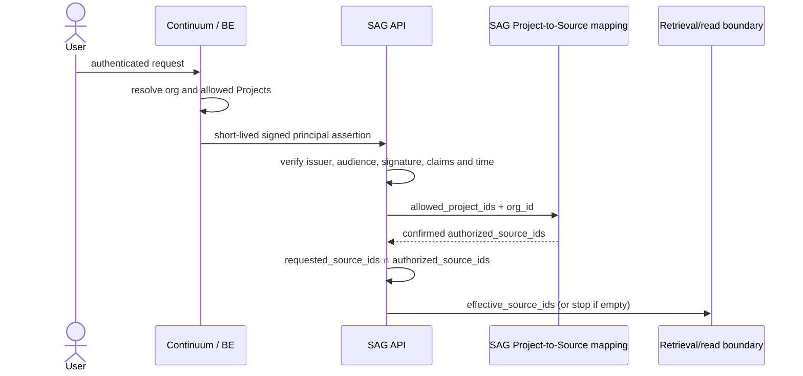

# Principal Assertion Contract — Continuum to SAG

> **Status:** Draft for BE/Continuum and security review. Not frozen and not a
> statement that a runtime issuer or verifier is already deployed.
>
> **Date:** 2026-09-30
> **Authority:** BE/Continuum resolves identity, organization context, and
> Project authorization. SAG verifies the signed decision and consumes the
> resolved scope; SAG does not infer membership, roles, or permission hierarchy.

## 1. Scope and security invariants

This contract covers user or service-principal requests that can produce or
read SAG evidence. It is not a replacement for Continuum's ordinary browser
access token and does not grant Source-mapping administration by itself.

The assertion and its verifier must preserve these invariants:

1. No verified principal means no retrieval or evidence read.
2. A Source without a confirmed Project mapping is not searchable/readable.
3. No dense, lexical, graph/event, or direct-read evidence candidate may be
   generated outside the resolved effective Source scope.
4. Client-supplied Source IDs can only narrow the authorized set.



## 2. Token and transport profile (proposed v1)

| Property | Contract proposal | Review note |
|---|---|---|
| Token form | Compact JWS carrying a JWT payload; SAG receives it in `X-SAG-Principal-Assertion` over TLS from a trusted BE/BFF hop | The existing `Authorization: Bearer` remains SAG's local application credential for user-owned API state. It never authorizes evidence. Do not expose the assertion to browser storage or accept browser-controlled scope claims. |
| `iss` | Exact, environment-specific Continuum issuer identifier configured by SAG | SAG accepts only configured issuer values; no issuer supplied by the request can add trust. Exact production URI/identifier is pending BE. |
| `aud` | Exact SAG API audience, proposed literal `sag-api` | A token for another service is invalid. No wildcard or substring audience checks. |
| `sub` | Stable, opaque canonical Continuum user/principal ID | SAG uses it for principal identity/audit only, not role lookup. Service identities need an explicit service-principal profile issued by BE. |
| `orgId` | Canonical Organization ID using the current BE/IAM wire naming | SAG normalizes this to internal `org_id`. Do not add a second `tenantId` claim unless BE confirms a distinct tenant boundary and defines its consistency rule. |
| `allowedProjectIds` | Proposed required array of unique, non-empty opaque Project IDs resolved by BE for this principal and `orgId` | SAG normalizes this to internal `allowed_project_ids`. Empty array is valid and means no accessible Projects; missing/malformed is invalid. The current BE access token does not provide this claim, so it is a new assertion-contract requirement. SAG never substitutes `activeProjectId`, a role, or a client value. |
| `iat`, `exp` | Required NumericDate claims | `exp` must be later than `iat`; maximum lifetime is enforced by local config. |
| `nbf` | Optional NumericDate; when present it is validated with the same skew policy | Avoid adding it unless the issuer has a real activation-time requirement. |
| `jti` | Required unique issuance identifier for correlation/revocation operations | Proposed bearer profile does **not** consume `jti` as a single-use nonce. No replay prevention is claimed. |
| `roles`, `activeProjectId`, Source/document IDs | Not authorization inputs; omit from the assertion profile | SAG ignores roles and rejects alternate Organization/Project/Source/document scope aliases; it never widens `allowed_project_ids`. |

The assertion must not contain `authorized_source_ids` as a long-lived snapshot.
SAG derives Sources from its current confirmed mapping so mapping changes take
effect independently of the next user token.

## 3. Claims shape and validation

The v1 required claim set is:

```json
{
  "iss": "<configured-continuum-issuer>",
  "aud": "sag-api",
  "sub": "<opaque-principal-id>",
  "orgId": "<opaque-organization-id>",
  "allowedProjectIds": ["<opaque-project-id>"],
  "iat": 0,
  "exp": 0,
  "jti": "<unique-issuance-id>"
}
```

The example is structural only; values are not credentials. The issuer and SAG
must agree whether the project list is capped by count/token size. SAG must
reject an over-limit assertion rather than silently truncate its authorization
scope. The numeric limit is an open freeze item because it must fit actual BE
membership sizes and service header limits.

Validation requirements:

- Require exactly one trusted principal token on protected evidence requests.
- Verify the JWS signature before trusting any payload claim.
- Match `iss` and `aud` exactly against deployment configuration.
- Require non-empty `sub` and `orgId`; require `allowedProjectIds` to be an
  array of unique, non-empty strings. An empty array returns no evidence.
- Require safe integer `iat`/`exp`, enforce maximum lifetime, and reject an
  `iat` too far in the future or an expired/not-yet-valid assertion.
- Ignore no cryptographic validation error and never retry the request without
  the principal scope.
- Do not decode Continuum roles, memberships, or `activeProjectId` to repair an
  invalid or incomplete assertion.

## 4. Signature, JWKS and key rotation

### Proposed algorithm

Use asymmetric signing so SAG receives verification keys but cannot mint
Continuum assertions. Proposed v1 allowlist is **RS256 only**; reject `none`,
HMAC algorithms, and every algorithm not explicitly configured. Do not let the
JWT header negotiate an algorithm.

BE's current ordinary access token implementation uses a custom HS256 profile,
with `orgId`, `roles`, optional `activeProjectId`, and a 15-minute lifetime. It
does not carry `iss`, `aud`, or `allowed_project_ids`. It is not this contract
and must not be reused as a SAG principal assertion. In particular, do not share
the existing symmetric `JWT_SECRET` with SAG.

The pre-ACL baseline declared PyJWT without its `crypto` extra. The runtime ACL
implementation now declares the asymmetric verification dependencies directly;
this does not establish production signer/key-management acceptance.

### JWKS trust and rotation proposal

- Configure an exact `iss`, exact SAG `aud`, and a fixed trusted JWKS URI per
  environment. The URI must come from deployment configuration, not token
  headers or request input.
- Require `kid`; select only a key from the configured issuer's JWKS whose
  `kid`, `kty`, `use`/`key_ops`, and `alg` are compatible with RS256.
- Accept public RSA verification material only; reject any JWKS entry containing
  private RSA parameters (`d`, `p`, `q`, `dp`, `dq`, `qi`, or `oth`) as a key-set
  configuration failure.
- Do not follow untrusted `jku`/`x5u`, arbitrary redirects, or arbitrary issuer
  discovery. Apply TLS, bounded connect/read timeouts, response-size limits, and
  safe JSON parsing to JWKS fetches.
- Cache a successfully validated JWKS for at most 60 seconds (configurable with
  a hard maximum). On an unknown `kid`, refresh immediately, with at most one
  forced refresh per verifier per second to prevent attacker-controlled `kid`
  values from amplifying unauthenticated traffic into unbounded JWKS requests.
  If still unknown or refresh fails, deny and perform no retrieval. Never
  accept stale unknown keys or switch to a shared secret.
  Concurrent refreshes share one in-flight fetch outside the cache lock.
  Fresh known keys remain usable during an unknown-key refresh; expired cache
  entries require a successful refresh and are never served as a fallback.
  The application lifespan reuses and closes the bounded JWKS HTTP client and
  cancels unfinished refresh work during shutdown.
- Publish a new public key before signing with it. Retain the previous key for
  at least the maximum assertion lifetime plus clock skew and normal JWKS cache
  age; remove/deny a compromised key through an explicit emergency key deny
  mechanism and bounded cache expiry.
- Record key ID and issuer in security-safe logs; never record the assertion,
  signature, private key, or full claims.

The proposed `RS256` choice depends on BE key-management approval. SAG declares
`pyjwt[crypto]` and `cryptography` directly; the lockfile pins the resolved crypto
implementation. Production key custody still requires review.

## 5. Lifetime and replay proposal

Use a **short-lived bearer assertion**, with configurable values rather than
unreviewed constants:

```text
SAG_PRINCIPAL_ASSERTION_MAX_LIFETIME_SECONDS = 120   # proposed default
SAG_PRINCIPAL_ASSERTION_CLOCK_SKEW_SECONDS = 5       # proposed maximum
SAG_PRINCIPAL_JWKS_CACHE_TTL_SECONDS = 60            # proposed default
```

Require `exp > now - skew`, `iat <= now + skew`, and `0 < exp - iat <= max
lifetime`; validate `nbf` when present. Startup must reject non-positive or
unsafe configuration. With the proposed values, a project-access revocation
can remain effective only for an already-issued assertion until its expiry,
bounded by at most 120 seconds plus the 5-second verifier tolerance. Do not
claim immediate revocation. If BE requires faster revocation, add a real
introspection/revocation contract before freeze.

The proposed replay model is bearer semantics: `jti` is unique and useful for
correlation, but is not atomically consumed. A stolen assertion may be replayed
inside its short validity window; TLS, service-to-service controls, exact
audience and redaction limit that exposure. Do not call this replay protection.
If single-use replay prevention is required, it needs a shared distributed
replay store with atomic check-and-set and TTL no later than `exp`; a
process-local cache is explicitly insufficient.

## 6. Failure behavior

| Failure | Result | Retrieval behavior |
|---|---|---|
| Missing, malformed, invalid signature, wrong issuer/audience, bad claims, future `iat`, expired token | `401`-class authentication failure | No Source query or retrieval call. |
| Unknown `kid` after one JWKS refresh | `401`-class verification failure | No retrieval call. |
| JWKS unavailable and no still-valid configured key can verify the assertion | `503`-class dependency failure | No retrieval call; never fall back to local SAG user JWT, connector-global access, or no-filter search. |
| Valid principal with empty Project scope or empty effective Source scope | Empty/no-evidence response | Do not invoke dense, lexical, event/graph, or direct-read engine calls. |
| Mapping store unavailable or mapping resolution ambiguous | `503`-class authorization dependency failure | No evidence; do not use an unbounded or stale fallback. |

For explicit unauthorized Source IDs, use the API's non-enumerating behavior:
search intersects and returns no matching evidence; a direct Source/document read
must not distinguish an unauthorized object from a nonexistent one.

## 7. Principal propagation and non-user integrations

- A BE/BFF request must issue an assertion for the authenticated principal and
  pass it to SAG server-to-server. The browser-supplied Continuum access token
  is not the SAG assertion.
- Every agent run and internal tool must carry the verified principal/effective
  scope; a tool may only narrow that scope.
- Dify API keys, connectors, MCP HTTP sessions, and MCP stdio are not user
  assertions. Each needs a Continuum-issued scoped service principal/grant.
  Until that contract exists, the corresponding evidence path must reject or be
  disabled; it must not receive all Sources by default.
- Local SAG JWT authentication may continue for non-evidence settings and
  identity bootstrap, but it is not authorization for evidence-producing
  paths in the Continuum-integrated deployment.

## 8. Contract tests versus runtime acceptance

Contract tests can use an ephemeral asymmetric key pair and a local JWKS
fixture to test signature/claim validation, issuer/audience, lifetime, key
rotation, empty project scope, and failure behavior. They prove SAG's verifier
implements this proposed contract only.

They do not prove Continuum resolves real Projects, signs production assertions,
or propagates revocation. P1 acceptance still requires a real BE-issued
assertion, production key discovery/rotation, real mappings, bounded real
revocation, and leakage tests across every reachable evidence path.

## 9. Required security review decisions

| Decision | Draft recommendation | Status before freeze |
|---|---|---|
| Assertion header | `X-SAG-Principal-Assertion`; local SAG bearer remains a separate application identity where required | BE/BFF confirms trusted server-side propagation and proxy header overwrite/stripping. |
| Canonical org claim | Wire claim `orgId`, matching current BE/IAM naming; normalize internally to `org_id` | BE IAM owner confirms canonical identifier. |
| Issuer and JWKS URI | Exact environment-configured Continuum issuer + fixed JWKS URI | BE supplies production identifiers/key custody. |
| Algorithm | Dedicated asymmetric key, `RS256` only | Confirm BE signer and SAG `PyJWT[crypto]` direct dependency. |
| Audience | Exact `sag-api` | Confirm deployment audience naming. |
| Max lifetime / skew | 120s / 5s | BE and security owner approve revocation window. |
| Replay | Short-lived bearer; `jti` correlation only, no single-use guard | Security owner approves exposure or requests shared replay store. |
| Project count/token size cap | Reject over-limit; never truncate | Agree numeric cap from realistic memberships/proxy limits. |
| Service principals | Authority-issued scoped grant; static keys alone do not grant evidence | BE defines Dify/MCP/connector issuance and lifecycle. |
| Failure status | 401 for invalid assertion, 503 for unavailable trust/mapping dependency, zero retrieval either way | Align with public API error convention. |

No implementation may treat this draft as frozen until these rows are reviewed
and the issuer/scope contract exists in BE/Continuum.
